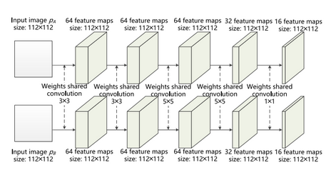

# PyTorch-Siamese-CNN :people_holding_hands: :robot:

This repository contains a PyTorch implementation of the paper titled: Change Detection Based on Deep Siamese Convolutional Network for Optical Aerial Images ([:link: Yang Zhan, Kun Fu, et al.](https://ieeexplore.ieee.org/abstract/document/8022932))

## The Architecture

<p align="center">
  
</p>

Two different views of an image are resized to a $`112 x 112`$ size. Both the branches of the CNN have shared weights. The final layer gives out a feature tensor of shape $`112 x 112`$ with $`16`$ channels which can be interpreted as a feature dimension. 

<p align="center">
  
</p>

Two feature tensors are output by running the forward pass twice through the CNN. A loss function based on a distance metric between these feature tensors is used to optimize the parameters of this architecture. The loss function is defined in the next section. 

## Loss Function

A distance metric $` D_w(X_1, X_2)_{i,j} = \|G_w(X_1)_{i,j} - G_w(X_2)_{i,j}\|_2 `$ is defined for each pixel coordinate $`i, j`$ where $`G_w(X)_{i,j}`$ is a feature vector indexed from the feature tensor that is output from the Siamese network.

The loss function is defined as
```math
l(W) = \sum_{k=1}^P{L(W, Y, X_1, X_2)^k} 
     = \sum_{k=1}^P \sum_{i,j}{(1 - y_{i,j}^k) L_U(D_{i,j}^k)} + y_{i,j}^k L_C(D_{i,j}^k)
```
where $`y`$ is a binary map of the same shape as the input images. $`y_{i,j} = 1`$ if there is a change between the two aerial images at position $`{i, j}`$ and $`y_{i,j} = 0`$ if there is no change detected. 

$`L_U `$and $`L_C`$ are defined as
```math
L_U(D_{i,j}^k) = \frac{1}{2} (D_{i,j}^k)^2
```

```math
L_C(D_{i,j}^k) = \frac{1}{2} \{max(0, m - D_{i,j}^k)^2\}
```
where $`m > 0`$ is a margin. If there is no change at $`{i, j}`$, the distance metric is penalized in the loss function. If there is a change at that particular position, the distance metric is softly assigned to the value $`m`$ where $`m = 1`$.

## References

**SZTAKI AirChange Benchmark set**: This Benchmark set contains 13 aerial image pairs of size 952x640 and resolution 1.5m/pixel and binary change masks (drawn by hand), which were used for evaluation in publications [1] and [2]. ([:link: Dataset](http://web.eee.sztaki.hu/remotesensing/airchange_benchmark.html))

```
[1] Cs. Benedek and T. Szirányi: ”Change Detection in Optical Aerial Images by a Multi-Layer Conditional Mixed Markov Model”, IEEE Transactions on Geoscience and Remote Sensing, vol. 47, no. 10, pp. 3416-3430, 2009
```
```
[2] Cs. Benedek and T. Szirányi: ”A Mixed Markov Model for Change Detection in Aerial Photos with Large Time Differences”, International Conference on Pattern Recognition (ICPR), Tampa, Florida, USA, December 8-11, 2008 
```
